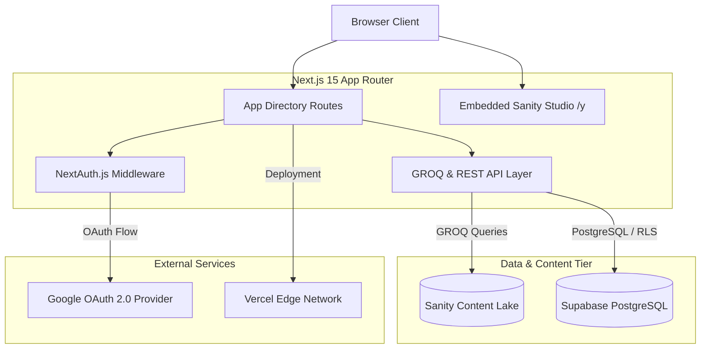

# Kelas Pekerja — Headless Literacy Platform

[](https://nextjs.org/)
[](https://www.sanity.io/)
[](https://www.typescriptlang.org/)
[](https://supabase.com/)
[](LICENSE)

A modern, high-performance web platform designed for literary publishing, digital reading, and content management. Built with **Next.js 15 (App Router)**, **Sanity CMS Content Lake**, **Supabase PostgreSQL**, and **NextAuth.js**.

---

## 🏗️ System Architecture

The application adopts a decoupled Headless CMS architecture combined with relational storage for user state management.



---

## ⚡ Technical & Engineering Highlights

- **Hybrid Rendering Model**: Leverages Next.js 15 Server Components with static generation (SSG) and dynamic server-side rendering (SSR/ISR) for optimal core web vitals and fast Time-to-Interactive (TTI).
- **Headless Content Lake**: Powered by Sanity Studio embedded directly within the application path (`/y`). Content schemas are strictly typed with TypeScript (`book`, `post`, `quote`, `user`, `siteConfig`).
- **Resilient Fallback Data Layer**: Includes an automatic fallback pipeline during static site generation to guarantee non-blocking production builds even under upstream network constraints.
- **Relational User State & Security**: NextAuth.js handles OAuth 2.0 authentication, while Supabase PostgreSQL manages persistent bookmarks, quote tables, and user reading progress.
- **Automated Testing Suite**: Multi-tier quality assurance utilizing **Jest** for unit/integration tests and **Playwright** for end-to-end user browser interactions.

---

## 🛠️ Technology Stack

| Component | Technology | Role & Purpose |
| :--- | :--- | :--- |
| **Frontend Framework** | Next.js 15 (React 18) | App Router, Server Components, Route Handlers |
| **Content Engine** | Sanity CMS (v3) | Content Lake, GROQ query engine, visual editor |
| **Database & Auth** | Supabase & NextAuth.js | PostgreSQL relational data, Row Level Security, Google OAuth |
| **Styling & UI** | Tailwind CSS & Framer Motion | Design system tokens, micro-interactions, responsive layouts |
| **Quality Assurance** | Jest & Playwright | Unit testing, integration specs, E2E browser automation |
| **Type Safety** | TypeScript 5 | Strict interface declarations across CMS schemas and components |

---

## 📁 Repository Structure

```
kelas-pekerja/
├── .github/workflows/     # CI/CD pipeline automated workflows
├── e2e/                   # Playwright end-to-end testing scripts
├── public/                # Static assets & dynamic fallback datasets
├── src/
│   ├── app/               # Next.js App Router (pages, layouts, API routes)
│   ├── components/        # Component library (UI, layout, navigation)
│   ├── contexts/          # React Context API state providers
│   ├── hooks/             # Custom utility React hooks
│   ├── lib/               # Data fetching abstractions (Sanity GROQ, Supabase client)
│   ├── sanity/            # Sanity Studio configuration & schema definitions
│   └── types/             # Domain TypeScript interface specifications
├── supabase-quotes-table.sql  # Supabase database schema initialization script
└── next.config.js         # Production Next.js build configuration
```

---

## ⚙️ Local Development Setup

### Prerequisites

- **Node.js**: `v18.x` or higher (LTS recommended)
- **npm**: `v9.x` or higher

### 1. Environment Configuration

Create a `.env.local` file in the root directory based on the following environment specification:

```bash
# Sanity Headless CMS
NEXT_PUBLIC_SANITY_PROJECT_ID=your_sanity_project_id
NEXT_PUBLIC_SANITY_DATASET=production
NEXT_PUBLIC_SANITY_API_VERSION=2024-01-01
SANITY_API_TOKEN=your_sanity_api_token

# NextAuth & OAuth Provider
NEXTAUTH_URL=http://localhost:3000
NEXTAUTH_SECRET=your_nextauth_secret_key
GOOGLE_CLIENT_ID=your_google_client_id
GOOGLE_CLIENT_SECRET=your_google_client_secret

# Supabase Database
NEXT_PUBLIC_SUPABASE_URL=https://your-project.supabase.co
NEXT_PUBLIC_SUPABASE_ANON_KEY=your_supabase_anon_key
```

### 2. Developer Commands

```bash
# Install project dependencies
npm install

# Run local development server
npm run dev

# Execute unit test suite (Jest)
npm test

# Run end-to-end browser tests (Playwright)
npm run test:e2e

# Create optimized production build
npm run build

# Start production server
npm start
```

---

## 📄 License

Distributed under the MIT License. See `LICENSE` for more information.
